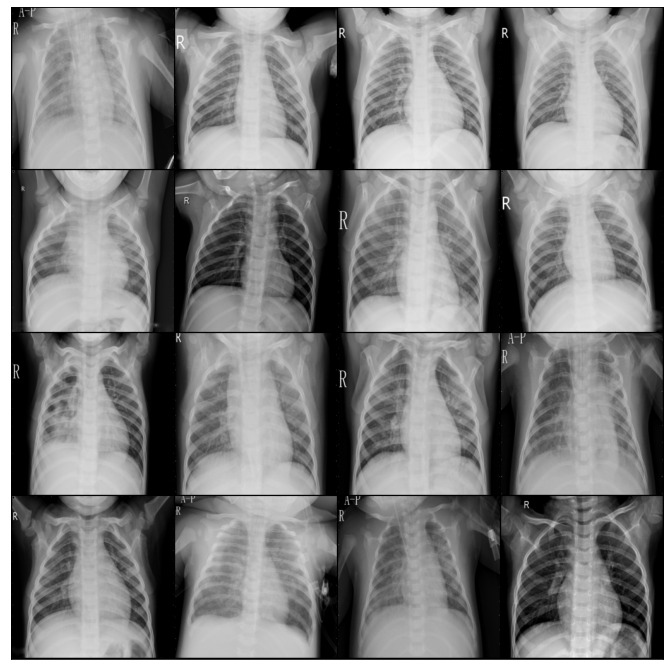
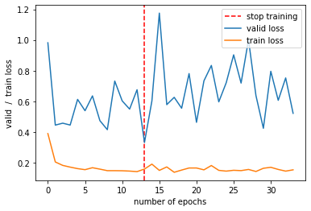

Objective
===

<span>The aim of this task is to prepare a program which classifies
chest X-ray images into those of a healthy patient and those of a patient
healthy patient and those showing a patient with pneumonia. </span>.

Introduction
============

<span>The aim of the implementation is to train a model using a
convolutional neural network. The model will be used to correctly
classify the Roentgen image and classify the patient as:
patient with pneumonia or healthy.</span>.

Description of implementation
==================

<span>The task was implemented in the Python 3 programming language.The model
was trained using the Pytorch machine learning library.
The process of training the model was implemented on a ready-made architecture
Resnet50 architecture to which 2 new layers were added.

Data sets
=============

In order to train the model we used the publicly available on the Internet
collection [*Chest X-Ray Images
(Pneumonia)*](https://www.kaggle.com/paultimothymooney/chest-xray-pneumonia).
The collection already has a separate training, test and validation collection.
The following graphs show the sizes of the collections.

There are 2 classes in the collection: diseased lungs and healthy lungs. Below
The training set, the validation set and the test set are presented below.


<center>

| Dataset        	| Normal 	| Pneumonia 	|
|----------------	|--------	|-----------	|
| Training set   	| 3875   	| 1341      	|
| Test set       	| 234    	| 390       	|
| Validation set 	| 8      	| 8         	|

</center>
<br/>

The fragments of the validation set are as follows:



As you can see the number of images describing each class is not
balanced. For this purpose, each group was assigned an appropriate weight.

```python
weights = [3, 1]
class_weights = torch.FloatTensor(weights).cuda()
criterion = nn.CrossEntropyLoss(weight=class_weights)
```

Workout description
=============

I decided to choose an off-the-shelf architecture called Resnet50. It is
It is very often used to solve problems of image
classification problems and is quite popular. The first step was to add
to the existing layers two new layers : Linear layer and
drop-out layer. These were the ones that were trained, the rest of the layers
have been blocked.

```python
model.fc = nn.Sequential(
    nn.Dropout(0.5),
    nn.Linear(num_features, 2))
```

Next, we freeze all the layers:

```python
for param in model.parameters():
    param.requires_grad = False
for param in model.fc.parameters():
    param.requires_grad = True
```

This method can significantly reduce model learning time and
use previously trained model layers.

```python
23,512,130 total parameters. 4,098 training parameters.

```
The number of parameters to be taught has been significantly reduced. For such
prepared model we start one learning process. Below we present
the selected parameters for training the model:
```python
learning_rate = 2e-3
num_epochs = 100
patience = 20
batch_size = 80
criterion = nn.CrossEntropyLoss(weight=class_weights)
optimizer = torch.optim.Adam(model.parameters(), lr=learning_rate)
```


The graphs for the first training show that the model achieved the best
result for 5 epochs then it just stopped. In the last stage
training was carried out for the model with unfrozen weights. After 5 epochs
no progress was noticed.



Results
======

The graph shows the accuracy of the trained model during the whole cycle
of training with frozen and unlocked weights. After training the model
it is necessary to check on the test set what final
accuracy of **87.77%**.

Summary
============

In the end the model achieved an accuracy of **87.77%**. It is able to
correctly identify from the image whether the patient has healthy or diseased
lungs. The application of transfer learning and the use of previously
transfer learning and use of pre-calculated weights and parameters significantly shortened the learning time of the model.
I think, that in order to achieve the result closer to 99%, it would be necessary to enrich the set with
more lung images of healthy patients because there is
disproportion between classes.


